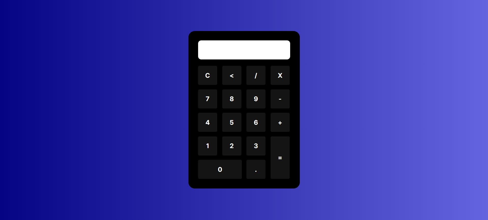

# 📟 Calculadora Simples

Uma calculadora básica feita com **HTML**, **CSS** e **JavaScript**.  
O objetivo deste projeto é praticar conceitos de estruturação com HTML, estilização com **Grid**, **Flexbox** e **Media Queries** para responsividade, além de funcionalidades com JavaScript.

---

## Pré-Visualização da Calculadora

---

## 🚀 Tecnologias Utilizadas
- **HTML5** → Estrutura da aplicação

- **CSS3** → Estilização com Grid, Flexbox e Media Queries

- **JavaScript** → Funcionalidades (inserir valores, limpar, apagar e calcular expressões)

---

## ⚙️ Funcionalidades
- Inserir números e operadores no display

- Limpar o display (`C`)

- Apagar o último caractere (`⌫`)

- Calcular expressões matemáticas com o botão `=` (utilizando `eval()` com tratamento de erros)

- Layout **responsivo** com **Media Queries**  

---

## 📚 Aprendizados

- Estruturação de layouts com **Grid e Flexbox**

- Responsividade com **Media Queries**

- Manipulação do **DOM** com JavaScript

- Uso de funções como `slice()`, `try...catch` e `eval()`
